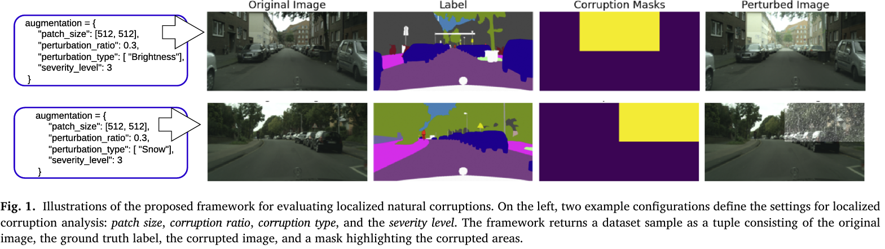

# Benchmarking Spatial Robustness of Segmentation Models  

This repository provides a **benchmarking framework** for evaluating the **spatial robustness** of semantic segmentation models.  
It supports both:  
- **Natural localized perturbations** (e.g., Snow, Fog, Rain) applied to specific image regions.  
- **Adversarial localized attacks** (e.g., PGD-based patch attacks) targeting selected areas of an image.  

The framework is currently configured for **Semantic Segmentation (SS)** tasks, but it is modular and can be extended to other vision tasks in the future.  



---


## Reference Paper  

This work is based on and should be cited together with the following publication:  

> **Benchmarking the spatial robustness of DNNs via natural and adversarial localized corruptions**  
> {Giulia {Marchiori Pietrosanti} and Giulio Rossolini and Alessandro Biondi and Giorgio Buttazzo 
> *Pattern Recognition*, 2025.  
> [ScienceDirect link](https://www.sciencedirect.com/science/article/pii/S0031320325010738)  

The paper introduces a systematic evaluation of spatial robustness by selectively perturbing localized areas of an image.  
It demonstrates how different models react to corrupted vs. clean regions and provides insights into model vulnerability to both natural and adversarial localized attacks.  
If you use this repository, **please consider cite out  paper**.  

---

## Notebook Demo  

To get started quickly, a **demo notebook** is included in the repository:  
- The notebook shows how to configure dataset loading, corruption types, patch ratios, and severity levels.  
- It demonstrates both **natural perturbation tests** and **adversarial evaluation** (localized PGD attack).  
- Visualizations (clean vs. corrupted performance) are provided to understand the benchmarking setup.  


---

## TODOs  

- [ ] Requirements file is in the cleaning phase (additional libraries will be added).  
- [ ] Refinement of some parts of the code is ongoing (e.g., eval scripts and model utilities).  

---

## Citation  

If you use this code in your research, please cite:  

```bibtex
@article{spatial_robustness_giuliaMP_PR_2025,
title = {Benchmarking the spatial robustness of DNNs via natural and adversarial localized corruptions},
journal = {Pattern Recognition},
volume = {172},
pages = {112412},
year = {2026},
issn = {0031-3203},
doi = {https://doi.org/10.1016/j.patcog.2025.112412},
url = {https://www.sciencedirect.com/science/article/pii/S0031320325010738},
author = {Giulia {Marchiori Pietrosanti} and Giulio Rossolini and Alessandro Biondi and Giorgio Buttazzo},
}
